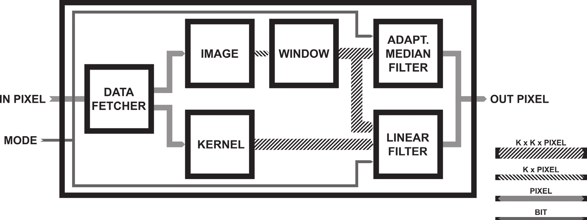

## Pipelined FPGA Architecture for Image Processing with Linear and Adaptive Median Filter

This paper describes a pipelined architecture for digital image processing with a linear and adaptive median filter on FPGA (Field-programmable gate array) chips. These algorithms achieve remarkable results in noise removal, specifically Guassian noise for linear filtering and impulse noise for adaptive median filtering. As such, they are often used by all systems which incorporate a camera, right after an image is obtained from the camera sensor. While these and many other similar image processing algorithms can be implemented on a regular general-purpose processor, such implementations are relatively time expensive, due to the fact that they require multiple readings of the same data from memory. This problem is most evident in time-critical or real-time video processing systems, which often have to choose between lowering the image/video resolution, reducing the framerate, or avoiding these algorithms entirely.

In order to avoid this compromise, more and more systems are starting to use specialized hardware modules that quickly and efficiently execute necessary denoising image processing algorithms, with minimal load on system memory. This paper describes one such module for linear and adaptive median filtering. 

The pipelined nature of the proposed architecture entails the division of a master process, that is executed into several smaller, mutually independent subprocesses, which are executed one after the other. Each of these subprocesses is implemented as a separate component that performs only that specific subprocess. Because the subprocesses are independent of each other, all components can operate in parallel, performing their specific subprocesses on different parts of the image. When a component completes its task, it passes its result to the next component and receives the result from the previous component. This enables maximum utilization of available resources, since no part of the architecture is idle, as well as a constant flow of data through the architecture, which eliminates the need for multiple readings of the same data, reducing the load on slow system memory and thus allowing much faster execution.

Adaptive median filtering requires finding the minimum, median and maximum of an array of values. As this task is relatively hard to execute in hardware, two different methods of finding the minimum, median and maximum values, were proposed and compared. The Bitonic sortmethod finds these values by sorting the array and then taking the first, middle, and last value respectively. The Cumulative histogram method constructs a cumulative histogram out of this array of values, and then finds the first bars which
contain one, half, and all values from the array respectively. Out of the two proposed methods, bitonic sorting proved superior, taking up 50% fewer registers and logic blocks and achieving a 20% higher maximum allowed frequency.

The whole architecture was synthesized and behaviorally simulated to confirm its functionality. The proposed module shows significant
promise for real-world use in time-critical image processing systems.

## Protočna FPGA arhitektura za filtriranje slike linearnim i adaptivnim medijanskim filtrom

U ovom radu je opisana digitalna protočna arhitektura na FPGA čipu za filtriranje slike, koristeći linearno i adaptivno medijansko filtriranje. Linearno filtriranje je metod obrade slike koji se najčešće koristi za izoštravanje slike, izdvajanje ivica i otklanjanje Gausovog šuma, dok se medijansko i adaptivno medijansko filtriranje uglavnom koriste radi otklanjanja impulsnog šuma i očuvanja kontura na slici. Opisana protočna arhitektura ima značajnu primenu u vremenski kritičnim, integrisanim sistemima, pošto otklanja potrebu za višestrukim pristupima istim podacima u memoriji i minimizuje vreme izvršavanja, po ceni većeg zauzeća logičkih i memorijskih jedinica. U slučaju adaptivnog medijanskog filtriranja, radi pronalaženja medijane skupa vrednosti piksela, implementirane su i upoređene dve arhitekture: bitoničko sortiranje i kumulativni histogram. Sintezom je potvrđeno da arhitektura za bitoničko sortiranje zauzima duplo manje registara i logičkih jedinica i da postiže 20% višu maksimalnu dozvoljenu učestanost signala takta.

|  |
| -- |
| Architecture overview of the image processing module |
| Pregled arhitekture modula za filtriranje slike |